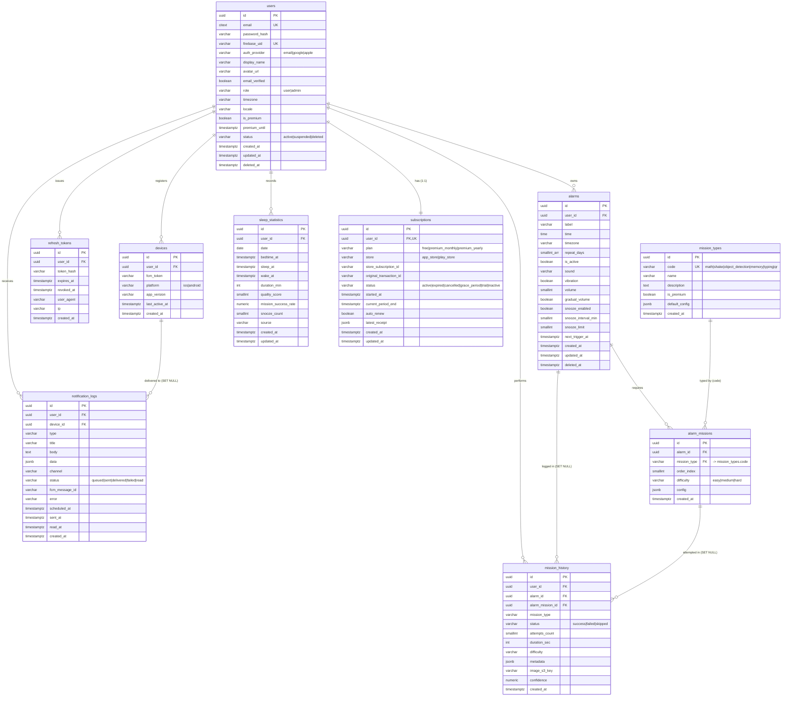

# AI Alarm Clock — Database ER Diagram & Schema Docs

PostgreSQL schema for the AI alarm clock app (Alarmy-style). All primary keys are
`uuid` (`gen_random_uuid()`), all tables carry `created_at timestamptz`, and
mutable tables additionally carry `updated_at` (auto-maintained by the
`set_updated_at()` trigger). Enum-like columns are enforced with `CHECK`
constraints rather than native ENUM types so they can evolve without
`ALTER TYPE` migrations.

The seven user-named (domain core) tables are centered below:
**Users, Alarms, AlarmMissions (`alarm_missions`), MissionHistory
(`mission_history`), Subscriptions, NotificationLogs (`notification_logs`),
SleepStatistics (`sleep_statistics`)**. Three supporting tables
(`refresh_tokens`, `devices`, `mission_types`) round out the model.

---

## ER Diagram (Mermaid)

> Note: Mermaid does not have an array primitive; `repeat_days` is shown as
> `smallint_arr` but is `smallint[]` in the actual schema.

---

## Relationships

| Parent | Child | Cardinality | On Delete | Notes |
| --- | --- | --- | --- | --- |
| users | alarms | 1:N | CASCADE | A user's alarms are removed with the user. |
| users | refresh_tokens | 1:N | CASCADE | Sessions die with the user. |
| users | devices | 1:N | CASCADE | Push targets die with the user. |
| users | mission_history | 1:N | CASCADE | History tied directly to the owning user. |
| users | notification_logs | 1:N | CASCADE | Audit logs removed with the user. |
| users | sleep_statistics | 1:N | CASCADE | Daily stats removed with the user. |
| users | subscriptions | 1:1 | CASCADE | Enforced by `UNIQUE(user_id)`. |
| alarms | alarm_missions | 1:N | CASCADE | Missions belong to one alarm. |
| alarms | mission_history | 1:N | SET NULL | Keep history even if the alarm is deleted. |
| mission_types(code) | alarm_missions | 1:N | (RESTRICT default) | `mission_type` FK -> `mission_types.code`. |
| alarm_missions | mission_history | 1:N | SET NULL | Keep history even if the mission def is deleted. |
| devices | notification_logs | 1:N | SET NULL | Log survives device removal. |

---

## Per-Table Column Documentation

### users
The account root. `email` is `citext` so uniqueness is case-insensitive.
`password_hash` is null for social-only accounts (Google/Apple). `firebase_uid`
links to Firebase Auth and is unique when present. `is_premium` / `premium_until`
are a denormalized fast-path cache of the authoritative `subscriptions` row.
`status` and `deleted_at` support suspension and soft-deletion.

### refresh_tokens
One row per issued refresh token. The raw token is **never** stored — only
`token_hash`. `expires_at` bounds validity; `revoked_at` marks rotation/logout.
`user_agent` and `ip` aid session auditing.

### devices
FCM push registration per physical device. `UNIQUE(user_id, fcm_token)` prevents
duplicate registrations. `platform` is `ios|android`. `last_active_at` enables
stale-token pruning.

### alarms
Core alarm definition. `time` is a wall-clock `time`; `timezone` resolves it to an
instant. `repeat_days` is a `smallint[]` of weekday ordinals (0=Sun..6=Sat); an
empty array means a one-shot alarm. `volume` (0–100), snooze settings, and
`gradual_volume` shape playback. `next_trigger_at` is the precomputed next fire
instant used by the scheduler. Soft-deletable via `deleted_at`.

### mission_types
Static catalog of dismissal-mission kinds, seeded by `schema.sql`. `code` is the
stable business key referenced by `alarm_missions.mission_type`. `is_premium`
gates paid missions (`object_detection`, `qr`). `default_config` holds per-type
default JSON parameters.

### alarm_missions
Missions a user must complete to dismiss a given alarm, ordered by `order_index`
(`UNIQUE(alarm_id, order_index)`). `mission_type` FK to `mission_types.code`
guarantees only valid types. `difficulty` is `easy|medium|hard`; `config`
overrides the type's `default_config`.

### mission_history
Append-only outcome log, one row per attempt session. `mission_type`,
`difficulty` are denormalized snapshots so analytics survive deletion of the alarm
/ mission. `status` is `success|failed|skipped`. For `object_detection`,
`image_s3_key` references a **private** S3 object (served via short-TTL presigned
URLs) and `confidence` (0.0000–1.0000) holds the AI score.

### subscriptions
Authoritative monetization state, 1:1 with `users`. `plan`, `status`, and the
store identifiers reflect server-validated receipts (`latest_receipt`). Premium is
derived here and never trusted from the client; `users.is_premium` mirrors it for
quick reads.

### notification_logs
Delivery audit trail across channels (`channel`, default `push`). `status` tracks
the lifecycle `queued -> sent -> delivered -> failed | read`. `fcm_message_id` and
`error` capture provider results; `device_id` is `SET NULL` so logs outlive
devices.

### sleep_statistics
One aggregated row per user per calendar `date` (`UNIQUE(user_id, date)`). Tracks
bedtime/sleep/wake instants, `duration_min`, `quality_score` (0–100),
`mission_success_rate` (0–100%), and `snooze_count`.

---

## Index List & Rationale

| Index | Table (cols) | Type | Rationale |
| --- | --- | --- | --- |
| `idx_users_email_active` | users(email) WHERE deleted_at IS NULL | partial | Fast login lookups, excludes soft-deleted accounts. |
| `idx_refresh_tokens_user_id` | refresh_tokens(user_id) | btree | List/revoke a user's sessions. |
| `idx_refresh_tokens_token_hash` | refresh_tokens(token_hash) WHERE revoked_at IS NULL | partial | Validate live tokens on rotation. |
| `idx_devices_user_id` | devices(user_id) | btree | Fetch a user's push targets. |
| `idx_alarms_user_id` | alarms(user_id) | btree | List a user's alarms. |
| `idx_alarms_next_trigger_active` | alarms(next_trigger_at) WHERE is_active AND deleted_at IS NULL | partial | Scheduler hot path: due active alarms only. |
| `idx_alarm_missions_alarm_id` | alarm_missions(alarm_id) | btree | Load an alarm's ordered missions. |
| `idx_alarm_missions_mission_type` | alarm_missions(mission_type) | btree | FK support / usage analytics by type. |
| `idx_mission_history_user_id` | mission_history(user_id) | btree | FK support. |
| `idx_mission_history_user_created` | mission_history(user_id, created_at DESC) | composite | Per-user timeline & analytics, recent-first. |
| `idx_mission_history_alarm_id` | mission_history(alarm_id) | btree | FK support. |
| `idx_mission_history_alarm_mission_id` | mission_history(alarm_mission_id) | btree | FK support. |
| `idx_subscriptions_user_id` | subscriptions(user_id) | btree | FK / 1:1 lookups. |
| `idx_subscriptions_current_period_end` | subscriptions(current_period_end) | btree | Renewal/expiry sweep jobs. |
| `idx_notification_logs_user_id` | notification_logs(user_id) | btree | FK support. |
| `idx_notification_logs_device_id` | notification_logs(device_id) | btree | FK support. |
| `idx_notification_logs_user_status` | notification_logs(user_id, status) | composite | Dashboard filters (e.g. failed pushes per user). |
| `idx_sleep_statistics_user_date` | sleep_statistics(user_id, date DESC) | composite | Per-user date-range sleep charts. |

---

## Constraint List

### Primary Keys
Every table: `id uuid PRIMARY KEY DEFAULT gen_random_uuid()`.

### Unique Constraints
- `users(email)`, `users(firebase_uid)`
- `devices(user_id, fcm_token)`
- `mission_types(code)`
- `alarm_missions(alarm_id, order_index)`
- `subscriptions(user_id)` (enforces 1:1 with users)
- `sleep_statistics(user_id, date)`

### Foreign Keys
- `refresh_tokens.user_id -> users.id` (CASCADE)
- `devices.user_id -> users.id` (CASCADE)
- `alarms.user_id -> users.id` (CASCADE)
- `alarm_missions.alarm_id -> alarms.id` (CASCADE)
- `alarm_missions.mission_type -> mission_types.code`
- `mission_history.user_id -> users.id` (CASCADE)
- `mission_history.alarm_id -> alarms.id` (SET NULL)
- `mission_history.alarm_mission_id -> alarm_missions.id` (SET NULL)
- `subscriptions.user_id -> users.id` (CASCADE)
- `notification_logs.user_id -> users.id` (CASCADE)
- `notification_logs.device_id -> devices.id` (SET NULL)
- `sleep_statistics.user_id -> users.id` (CASCADE)

### Check Constraints (enum-like and ranges)
- `users.auth_provider IN ('email','google','apple')`
- `users.role IN ('user','admin')`
- `users.status IN ('active','suspended','deleted')`
- `devices.platform IN ('ios','android')` (nullable)
- `alarms.volume BETWEEN 0 AND 100`
- `alarms.snooze_interval_min BETWEEN 1 AND 60`
- `alarms.snooze_limit BETWEEN 0 AND 20`
- `mission_types.code IN ('math','shake','object_detection','memory','typing','qr')`
- `alarm_missions.difficulty IN ('easy','medium','hard')`
- `mission_history.status IN ('success','failed','skipped')`
- `mission_history.difficulty IN ('easy','medium','hard')` (nullable)
- `mission_history.confidence BETWEEN 0 AND 1` (nullable)
- `subscriptions.plan IN ('free','premium_monthly','premium_yearly')`
- `subscriptions.store IN ('app_store','play_store')` (nullable)
- `subscriptions.status IN ('active','expired','cancelled','grace_period','trial','inactive')`
- `notification_logs.status IN ('queued','sent','delivered','failed','read')`
- `sleep_statistics.quality_score BETWEEN 0 AND 100` (nullable)
- `sleep_statistics.mission_success_rate BETWEEN 0 AND 100` (nullable)

### Triggers
`set_updated_at()` BEFORE UPDATE on each mutable table:
`users`, `alarms`, `subscriptions`, `sleep_statistics`.

### Extensions
- `pgcrypto` — `gen_random_uuid()` for all PKs.
- `citext` — case-insensitive `users.email`.

### Seed Data
`mission_types` is seeded with all six catalog rows
(`math`, `shake`, `object_detection`, `memory`, `typing`, `qr`) idempotently via
`ON CONFLICT (code) DO NOTHING`.
